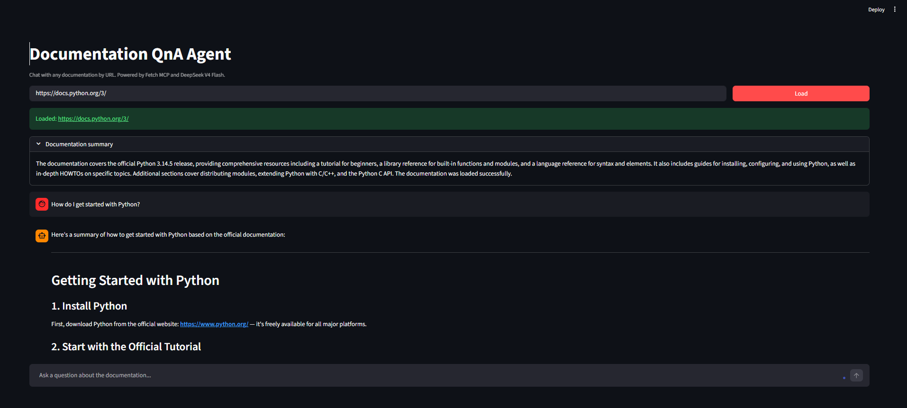

# Documentation QnA Agent

> Chat with any documentation by URL using Fetch MCP and DeepSeek V4 Flash on NVIDIA NIM.

## Overview

Documentation QnA Agent is a Streamlit application that lets you load documentation from any public URL and ask questions about it in natural language. The Fetch MCP server retrieves page content, a summary is generated automatically, and DeepSeek V4 Flash answers follow-up questions grounded in the fetched material. Conversation history is preserved for the duration of the session.

## Demo



## Features

- Load documentation from any HTTP or HTTPS URL
- Fetch and navigate content via the Fetch MCP server
- Automatic documentation summary on load
- Chat interface for follow-up questions
- Answers grounded in fetched documentation content
- Session-based conversation history across multiple questions
- Graceful handling of invalid URLs and fetch errors

## Tech Stack

| Layer | Technology |
|-------|------------|
| Agent Orchestration | LangChain + langchain-mcp-adapters |
| LLM | DeepSeek V4 Flash (`deepseek-ai/deepseek-v4-flash`) via NVIDIA NIM |
| Documentation Access | Fetch MCP Server (`mcp-server-fetch`) |
| UI | Streamlit |
| API Base URL | `https://integrate.api.nvidia.com/v1` |

## Prerequisites

- Python 3.10 or later
- An [NVIDIA API key](https://build.nvidia.com) (free, no credit card required)
- Git

## Installation

Clone the repository and navigate to the project directory:

```bash
git clone https://github.com/muhammadhussain-2009/AI-Agents-Projects-.git
cd Documentation QNA Agent 
```

Create and activate a virtual environment.

**Windows (PowerShell):**

```bash
py -m venv .venv
.\.venv\Scripts\Activate.ps1
```

**macOS / Linux:**

```bash
python3 -m venv .venv
source .venv/bin/activate
```

Install dependencies and configure environment variables:

```bash
pip install -r requirements.txt
copy .env.example .env
```

On macOS / Linux, use `cp .env.example .env` instead of `copy`.

Edit `.env` and set your `NVIDIA_API_KEY`.

## Usage

Start the Streamlit app:

```bash
streamlit run app.py
```

Open the URL shown in the terminal (typically `http://localhost:8501`).

1. Enter a documentation URL and click **Load**.
2. Review the generated summary in the expander.
3. Ask questions in the chat input at the bottom.

**Example:**

| Step | Input |
|------|-------|
| Documentation URL | `https://docs.python.org/3/` |
| Question | What is the latest stable Python version covered in this documentation? |
| Answer | Based on the fetched documentation, the site covers Python 3.14.5, which is listed as the current documentation release. |

## Environment Variables

| Variable | Required | Default | Description |
|----------|----------|---------|-------------|
| `NVIDIA_API_KEY` | Yes | N/A | API key from [build.nvidia.com](https://build.nvidia.com) (free, no credit card) |
| `NVIDIA_MODEL` | No | `deepseek-ai/deepseek-v4-flash` | NVIDIA NIM model ID used for summarization and Q&A |
| `FETCH_IGNORE_ROBOTS` | No | `0` | Set to `1` to bypass robots.txt restrictions for autonomous fetching |

Copy `.env.example` to `.env` before running the app:

```env
NVIDIA_API_KEY=your_nvidia_api_key_here
NVIDIA_MODEL=deepseek-ai/deepseek-v4-flash
```

## Project Structure

```text
documentation_qna_agent/
├── app.py              # Streamlit UI and session state
├── agent_service.py    # LangChain agent, MCP fetch, and NVIDIA NIM integration
├── requirements.txt    # Python dependencies
├── .env.example        # Environment variable template
├── assets/
│   └── demo.png        # Application screenshot
└── README.md
```
