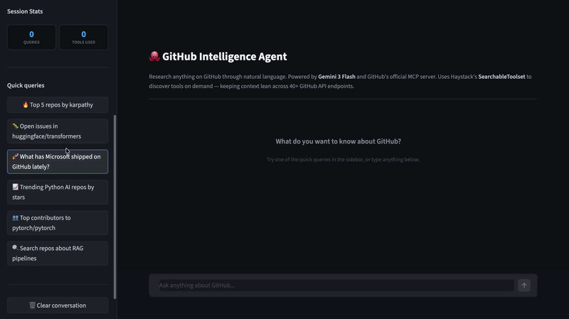

# GitHub Intelligence Agent

> Research anything on GitHub through natural language, powered by Gemini 3 Flash and GitHub's official MCP server



## Overview

GitHub Intelligence Agent connects Gemini 3 Flash to GitHub's official MCP server through Haystack, giving you a conversational interface to the entire GitHub API. Ask it anything: surface trending repositories, profile a contributor, summarise open issues, or explore a codebase. It figures out which tools to call on its own.

The agent uses Haystack's **SearchableToolset** to dynamically discover tools from GitHub's catalog of 40+ API endpoints. Instead of loading every tool schema upfront (which would blow the context limit), it searches for relevant tools by keyword and loads only what it needs. This keeps the context lean and the agent focused.

## Features

- **Natural language queries**: Ask in plain English, no GitHub API knowledge needed
- **Dynamic tool discovery**: SearchableToolset finds the right tools on demand, not all 40+ upfront
- **Full GitHub API access**: Search repos, profile users, read issues, explore code, and more
- **Streaming responses**: Answers appear token by token as the agent works
- **Conversation history**: Ask follow-up questions in the same session
- **Sidebar shortcuts**: One-click example queries to get started fast

## Tech Stack

**Frameworks and Libraries:**
- [Haystack](https://haystack.deepset.ai/): agent framework and tool orchestration
- [Streamlit](https://streamlit.io/): chat UI with streaming support

**Models and APIs:**
- [Gemini 3 Flash](https://aistudio.google.com/) via Google AI: reasoning and tool calling
- [GitHub MCP Server](https://api.githubcopilot.com/mcp/): official GitHub API over MCP

**Key Haystack Components:**
- `MCPToolset`: connects to GitHub's MCP server
- `SearchableToolset`: dynamically discovers tools to keep context lean
- `GoogleAIGeminiChatGenerator`: Gemini 3 Flash integration

## Prerequisites

- Python 3.11 or higher
- [uv](https://docs.astral.sh/uv/) (recommended) or pip
- API keys for:
  - [ ] Google Gemini (free at https://aistudio.google.com)
  - [ ] GitHub Personal Access Token (read-only permissions are enough)

### Getting a GitHub PAT

1. Go to GitHub → Settings → Developer Settings → Personal Access Tokens → Fine-grained tokens
2. Click "Generate new token"
3. Set resource owner to your account
4. Under "Repository access", select "Public repositories (read-only)"
5. No additional permissions needed
6. Copy the generated token

## Installation

### 1. Clone the Repository

```bash
git clone https://github.com/muhammadhussain-2009/AI-Agents-Projects-.git
cd AI-Agents-Projects-/Github Intelligence Agents (Gemini 3.5 + Github MCP)
```

### 2. Install Dependencies

```bash
uv sync
```

Or with pip:

```bash
pip install -r requirements.txt
```

### 3. Set Up Environment Variables

```bash
cp .env.example .env
```

Edit `.env` and add your keys:

```bash
GEMINI_API_KEY=your_gemini_api_key_here
GITHUB_PAT=your_github_pat_here
```

## Usage

```bash
uv run streamlit run app.py
```

Then open http://localhost:8501 in your browser.

You can also enter your keys directly in the sidebar without setting up `.env`.

**Example queries to try:**

- "What are the 5 most popular repos by karpathy?"
- "Summarise open issues in huggingface/transformers"
- "What has Microsoft been releasing on GitHub lately?"
- "Find trending Python AI repos sorted by stars"
- "Profile the top contributors to pytorch/pytorch"

## Project Structure

```
github_intelligence_agent/
├── agent.py          # Agent definition and MCP setup
├── app.py            # Streamlit chat UI
├── pyproject.toml    # Dependencies
├── .env.example      # Environment variables template
├── assets/           # Demo screenshots
└── README.md         # This file
```

## How It Works

When you send a query, Gemini 3 Flash first calls `search_tools` with keywords extracted from your question. Haystack's SearchableToolset searches the GitHub MCP tool catalog and loads only the 2 or 3 most relevant tool schemas into context. The model then calls those tools with precise parameters, gets the results back, and synthesises a structured response.

This on-demand tool loading is what makes the agent reliable. Loading all 40+ GitHub tool schemas at once would exceed the model's context window and cause hallucinations (like calling a tool named "search" that doesn't exist). SearchableToolset solves this by treating the tool catalog like a retrieval problem.

[Back to Top](#github-intelligence-agent)
